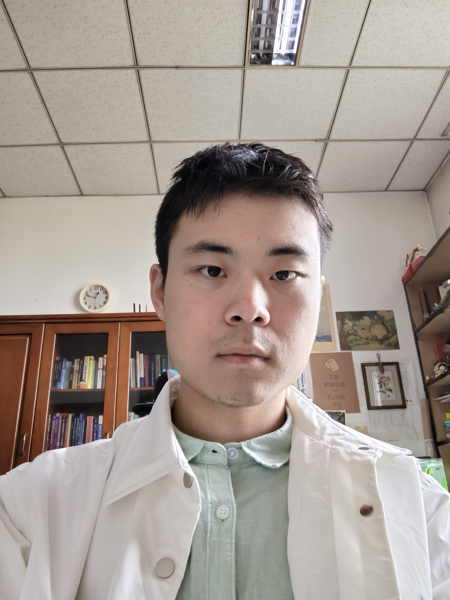

# About Me

Here is **Xinzhe Zhang (张信哲)**.

I am currently a 2ed-year graduate student in the department of physics at Nankai University, advised by [Prof.Chen](https://physics.nankai.edu.cn/cj/main.htm#:~:text=2008%E5%B9%B41).  Before coming to Chen's group, I also graduated from the Nankai University with a B.S. in Physics.
My research interests lie in Nanophotonics, PT symmetric optics, and PT symmetric optics.

If you are interested in any aspect of me, I am always open to discussions and collaborations. Feel free to cantact me.

---

## Research Interests

- Optics and Photonics
- Nonlinear optics
- Integrated Photonics
- Metasurfaces

My current research focuses on theoretical investigation of the electronic structure, transport and optical properties of nanostructures using analytical methods such as Finite-Difference Time-Domain (FDTD), and Finite Element Method (FEM).

---

## News

 > **I am seeking a PhD position 2025 (@zxzzhe).**
